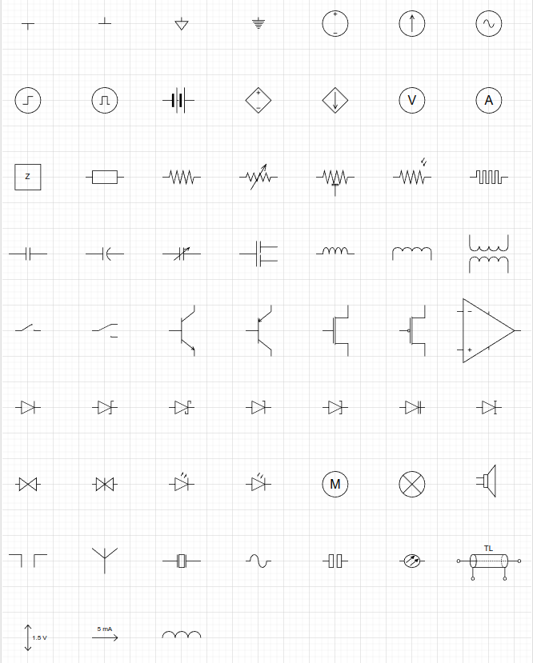
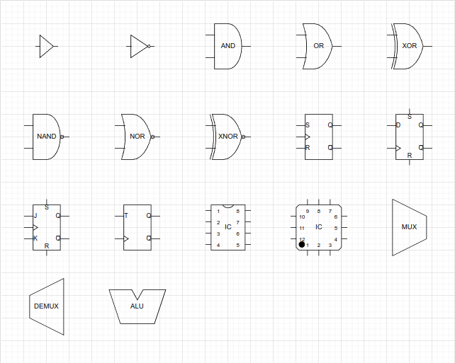
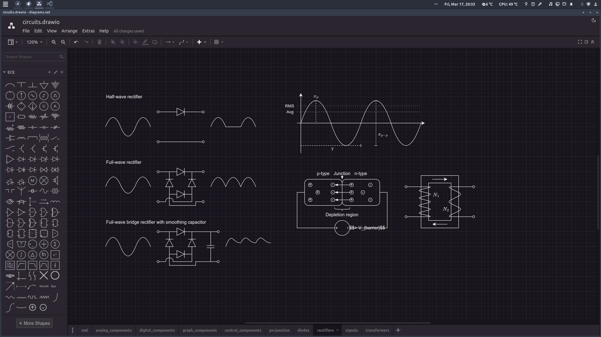

# Draw.io for ECE
This repository contains some custom-made draw.io-shapes - in the form of importable libraries - for drawing ECE-related diagrams, such as circuits and control-architectures in **Draw.io**.

## Motivation?
Other than LaTeX with the CircuiTikZ package, there aren't really any good ECE-drawing tools available, which can:

- Run offline on all OS's
- Produce textbook-quality circuit diagrams.
- Supports LaTeX math typesetting.
- Export vector-graphics, i.e. SVG.
- Auto-connect and update connections when moving components.

CircuiTikZ produces beautiful results, but it's time-consuming. Most people drawing circuits need a GUI. **Draw.io** is a general-purpose diagramming tool, which already contains libraries for drawing circuits.

The problem is that many of the shapes do not align themselves - or their connectors - to the drawing grid and are completely mismatched in size. They are also not setup to handle text-labels from the get-go, e.g. if you rotate an element, the symbol will be obscured by its own label.

This means that drawing circuits in **Draw.io** becomes much more of an exercise in aligning and scaling shapes, which is annoying and time-comsuming.

Hence this simple [library](ECE.xml).

## Importing
In Draw.io, simply click `File` in the menu-bar, and then choose `Open library` and then navigate to the `xml`-file. I highly recommend turning off view->guides as to make componenents only align to the grid.

These are the ECE-components, which are currently available.




Another benefit of Draw.io: Dark mode!


## Exporting
To use your drawings in your LaTeX-report, export them as a cropped PDF from Draw.io and then import them into your `.tex` document. This ensures that everything is formatted and positioned correctly.

You can optionally remove the white background by opening the PDF-file in Inkscape or similar, and delete it, then save as SVG. Here is a tiny Inkscape script that does exactly that:
```
inkscape --verb=EditSelectNext --verb=EditDelete --verb=FitCanvasToSelectionOrDrawing --verb=FileSaveAs --verb=FileSave --verb=FileClose --verb=FileQuit your_file.pdf
```

## Contributing
Want to add more components to the library?
- To create custom shapes in Draw.io, click `arrange` in the menu-bar, and then choose `insert` and then `shape`, which brings up an xml-editor with a preview. Check out the [example xml-files](components/) for inspiration.
- Make sure that your components align with the grid - especially their connection-points - when the element has its proper scaling.
- Remember to setup the text-label and try it in all four orientations.

I encourage you to read this [tutorial](https://drawio.freshdesk.com/support/solutions/articles/16000052874-create-and-edit-complex-custom-shapes), if you want to add complex custom shapes.

If you know of a better tool for drawing ECE-diagrams such as circuits for academic reports, let me know.

---
**LEGAL NOTICE**: This repository, including any and all of its forks and derivatives, may NOT be used in the development or training of any machine learning model of any kind, without the explicit permission of the owner of the original repository.
