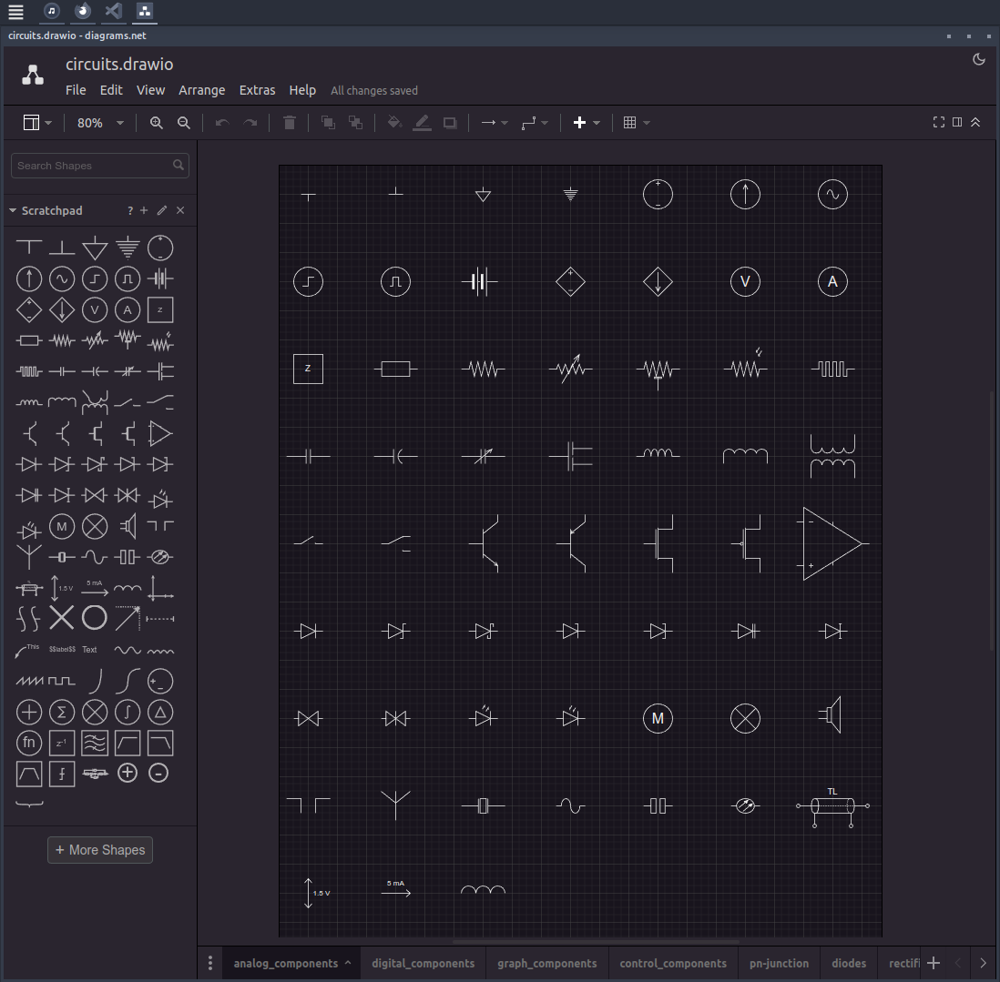

# Draw.io Circuits
This repository contains some custom-made draw.io-shapes - in the form of importable libraries - for drawing circuits in **Draw.io**.

## Motivation?
Other than LaTeX with the CircuiTikZ package, there aren't really any good circuit-drawing tools available, which can:

- Run offline on all OS's
- Produce textbook-quality circuit diagrams.
- Export vector-graphic, i.e. svg's and pdf.
- Auto-connect and update connections when moving elements.

CircuiTikZ produces beautiful results, but it's time-consuming. Most people drawing circuits need a GUI. **Draw.io** is a general-purpose diagramming tool, which already contains libraries for drawing circuits.

The problem is that many of the shapes do not align themselves - or their connectors - to the drawing grid and are completely mismatched in size. They are also not setup to handle text-labels from the get-go, e.g. if you rotate an element, the symbol will be obscured by its own label.

This means that drawing circuit in **Draw.io** becomes much more of an exercise in aligning and scaling shapes, which is annoying and time-comsuming.

Hence these simple [libraries](/libraries/), which aim to fix these issues.

## Importing
In Draw.io, simply click `File` in the menu-bar, and then choose `Open library` and then navigate to the `xml`-files.

These are the circuit-elements, which are currently available.
|                            |                              |
| -------------------------- | ---------------------------- |
|  |  |

Another benefit of Draw.io: Dark mode!

## Exporting
To use your drawings in your LaTeX-report, export them as a cropped pdf from Draw.io and then import them into your `.tex` document. This ensures that everything is formatted and positioned correctly.

## Contributing
Want to add more elements to the libraries?
- To create custom shapes in Draw.io, click `arrange` in the menu-bar, and then choose `insert` and then `shape`, which brings up an xml-editor with a preview. Check out the [example xml-files](elements/) for inspiration.
- Make sure that your elements align with the grid - especially their connection-points - when the element has its proper scaling.
- Remember to setup the text-label and try it in all four orientations.

If you know of a better tool for drawing circuits for academic reports, please contact me :)
